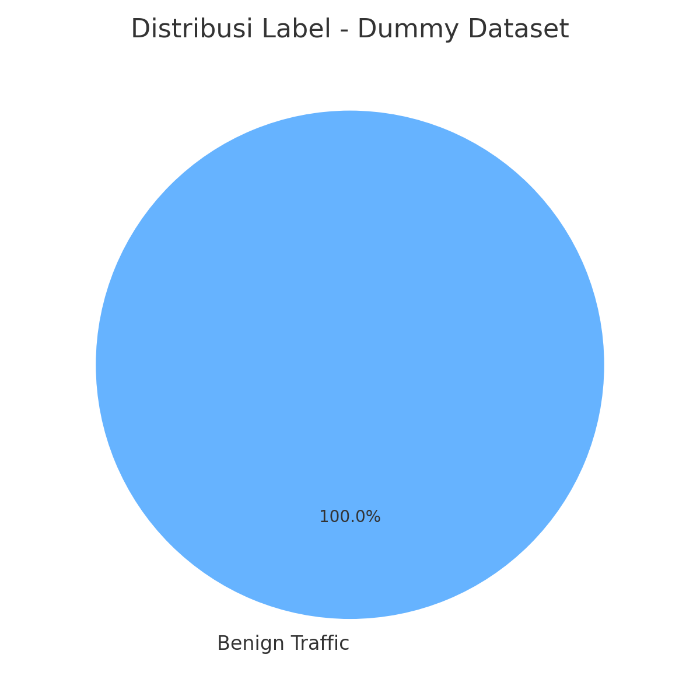

# 🧠 Proyek UAS Data Mining: Klasifikasi Traffic Jaringan

## 📌 Pendahuluan

Dalam dunia siber yang semakin kompleks, lalu lintas jaringan (network traffic) merupakan sumber data penting dalam mendeteksi ancaman seperti serangan DoS dan DDoS. Melalui proyek UAS ini, kami melakukan eksplorasi dan analisis terhadap dataset yang berisi traffic normal (benign) sebagai langkah awal membangun sistem deteksi dini berbasis machine learning.

---

## 🎯 Tujuan Proyek

- Mengeksplorasi dataset lalu lintas jaringan
- Mempersiapkan data untuk proses klasifikasi (pra-pemrosesan)
- Menjadi dasar awal untuk eksperimen deteksi serangan DDoS/DoS

---

## 📂 Dataset

Dataset ini terdiri dari:
- Jumlah Data: **32.620 entri**
- Jumlah Fitur: **85 fitur**
- Label: **1 jenis** — *Benign Traffic*

### 🧾 Contoh Fitur dalam Dataset
- IP dan Port (Src/Dst)
- Durasi aliran (Flow Duration)
- Jumlah paket FWD/BWD
- Rata-rata dan standar deviasi panjang paket
- Flag jaringan (SYN, ACK, URG)
- Throughput (Bytes/s dan Packets/s)
- Timestamp dan informasi protokol

---

## 📊 Distribusi Label

Saat ini, dataset hanya mencakup satu jenis traffic:

| Label            | Jumlah Data |
|------------------|-------------|
| Benign Traffic   | 32.620      |

Ini berarti semua data dalam file termasuk kategori **normal**. Dataset serangan akan ditambahkan untuk proses pelatihan model klasifikasi lebih lanjut.

---

## ⚙️ Rencana Pengembangan

1. 🔄 **Penambahan Data Serangan**
   - DDoS ICMP Flood
   - DoS ICMP Flood
   - DoS UDP Flood
   - DDoS UDP Flood

2. 🧪 **Pelatihan Model Klasifikasi**
   - Algoritma: Random Forest, SVM, Decision Tree, KNN
   - Metrik: Akurasi, Precision, Recall, F1-score
   - Visual: Confusion Matrix, ROC Curve

3. 🚀 **Integrasi Model**
   - Sebagai modul pendeteksi dini intrusi (IDS)
   - Integrasi ke sistem monitoring jaringan real-time

---

## 🛠️ Tools & Teknologi

- Python (pandas, scikit-learn, matplotlib)
- Jupyter Notebook
- GitHub Pages (untuk dokumentasi blog ini)
- Git (versi kontrol dan publikasi)

---

## 📚 Referensi

- [Scikit-learn Documentation](https://scikit-learn.org/)
- [Kaggle DDoS Dataset](https://www.kaggle.com/datasets)
- [Cloudflare: What is DDoS?](https://www.cloudflare.com/learning/ddos/what-is-a-ddos-attack/)

---

## ✍️ Penutup

Proyek ini merupakan bagian dari UAS mata kuliah **Data Mining**. Tahap awal ini mengeksplorasi struktur data benign traffic, dan akan berkembang menjadi sistem deteksi intrusi setelah penambahan data serangan. Seluruh proses dan hasil akan didokumentasikan melalui blog ini.

> Blog akan terus diperbarui seiring dengan penambahan data dan hasil eksperimen.
