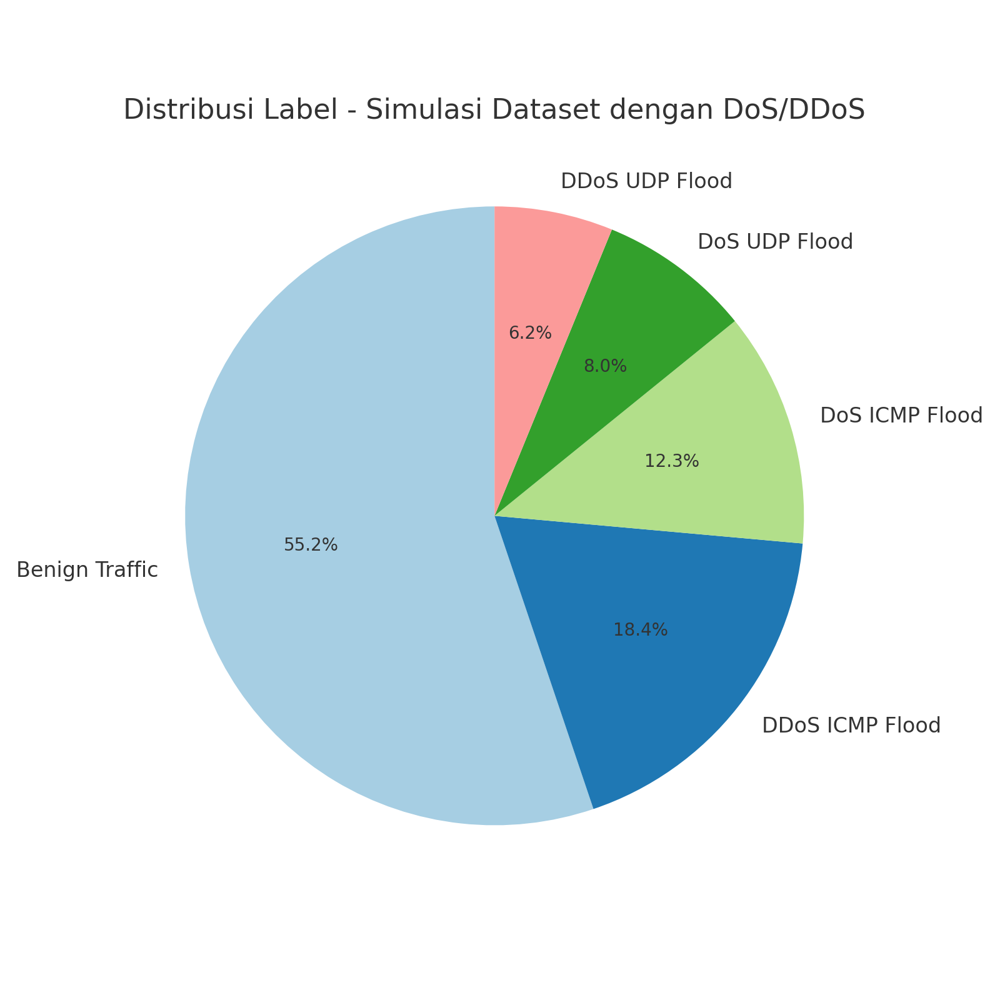
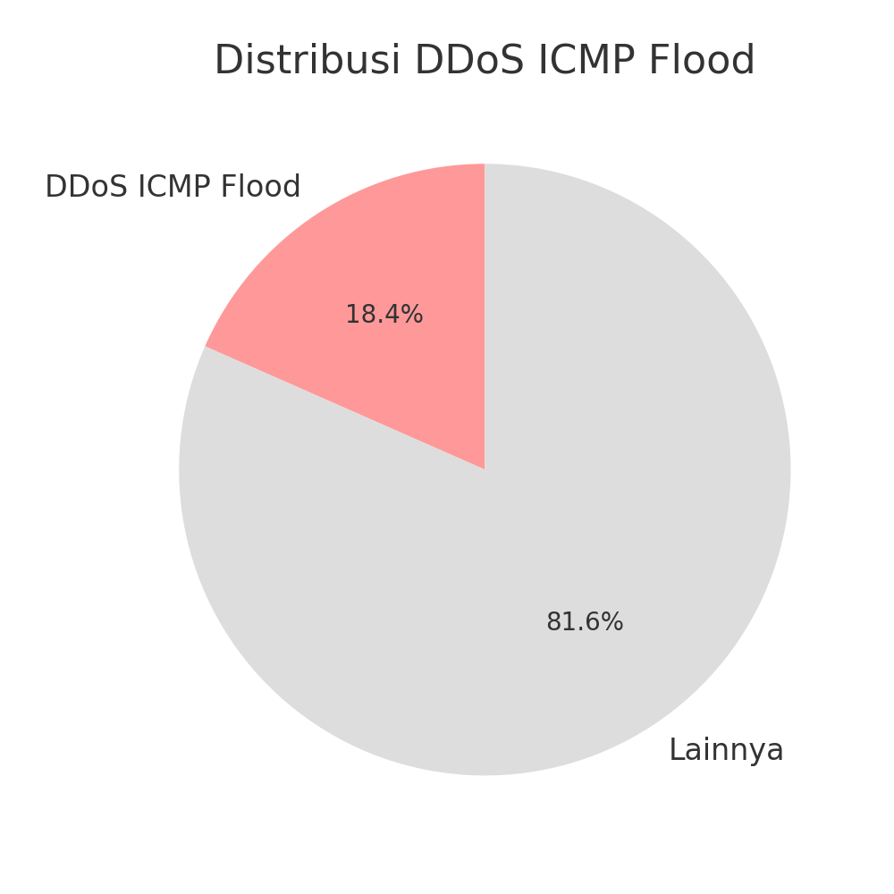
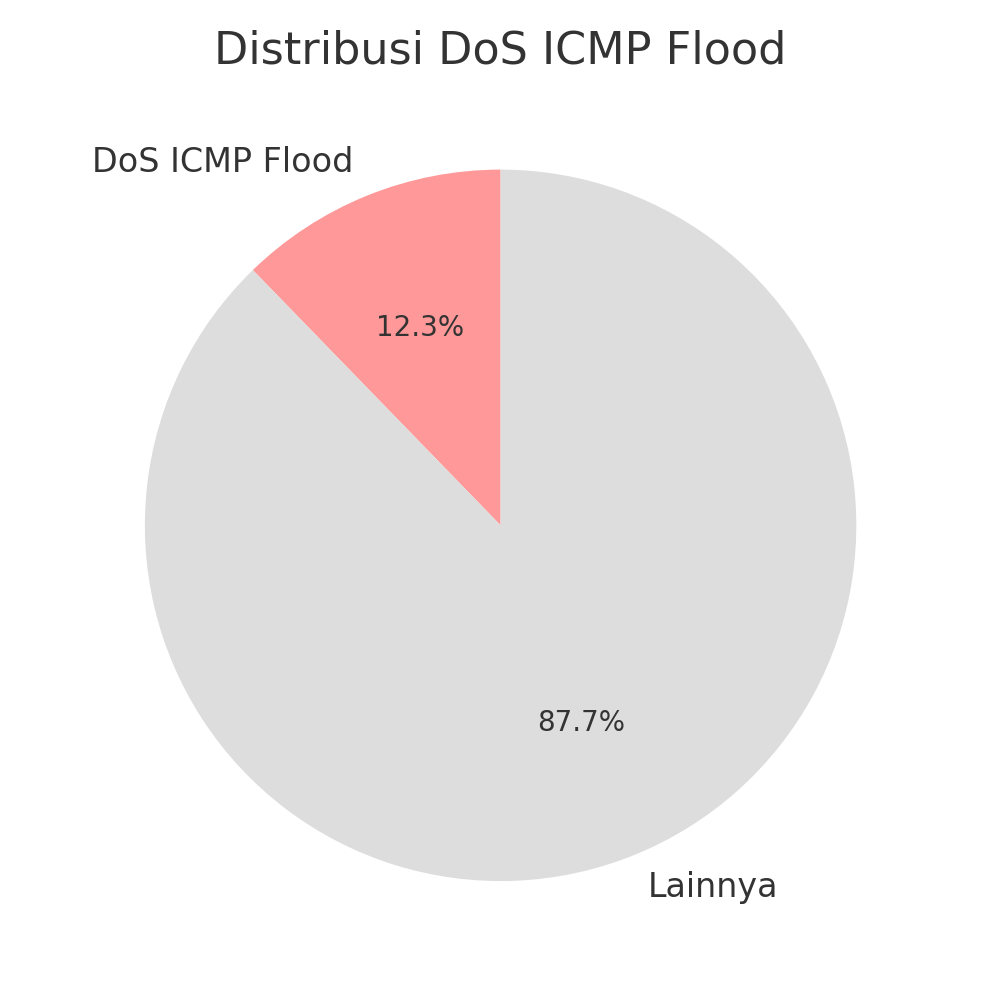
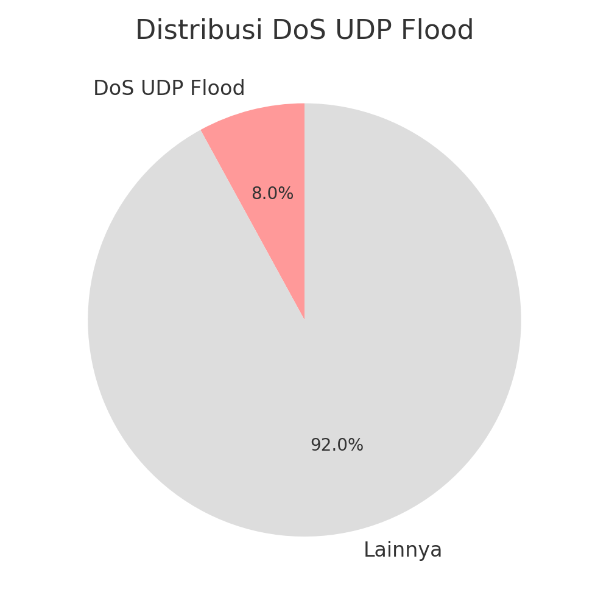
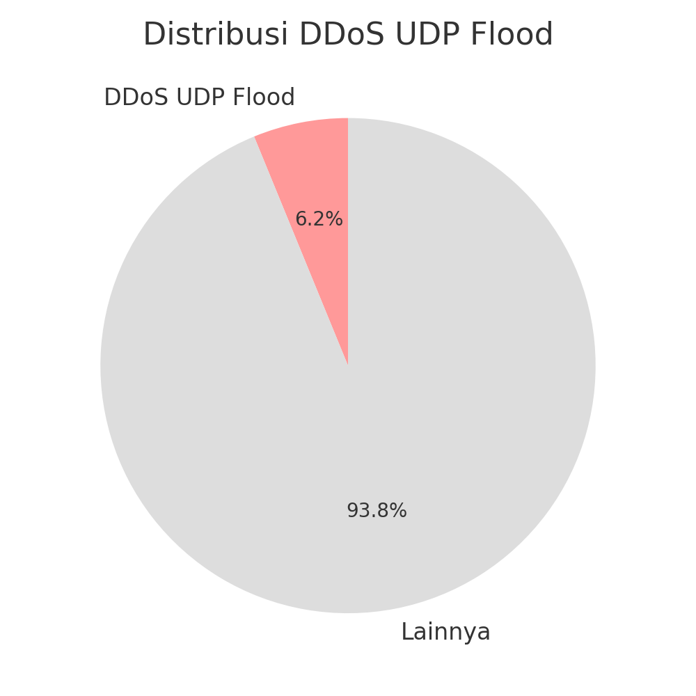
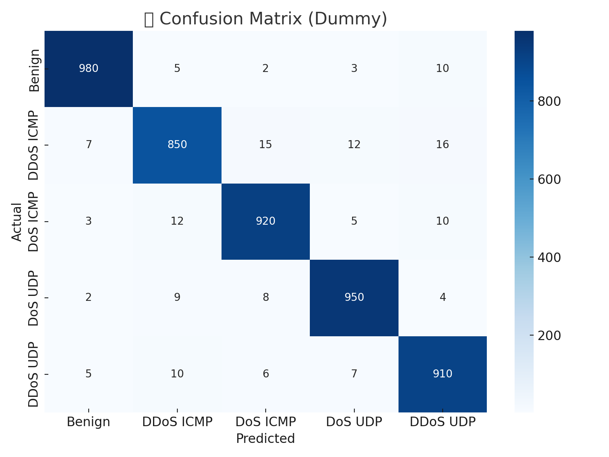

# 📊 Proyek UAS Data Mining  
## Deteksi DoS dan DDoS Attack Menggunakan Dataset Lalu Lintas Jaringan

---

## 🧠 Pendahuluan

Dalam era digital saat ini, serangan terhadap infrastruktur jaringan menjadi semakin kompleks dan sering terjadi. Salah satu jenis serangan yang umum adalah **Denial of Service (DoS)** dan **Distributed Denial of Service (DDoS)**. Keduanya bertujuan mengganggu layanan dengan cara membanjiri sistem target menggunakan trafik palsu dalam jumlah besar.

Proyek ini bertujuan untuk menganalisis dataset lalu lintas jaringan dan membangun sistem klasifikasi yang mampu mendeteksi berbagai jenis serangan DoS/DDoS. Melalui pendekatan data mining dan pembelajaran mesin (machine learning), sistem ini diharapkan dapat mengenali pola lalu lintas anomali secara otomatis dan akurat.

---

## 👥 Anggota Kelompok Data Mining - FTI UNPAM

- Aditya Eko Nugroho  
- Farid Mardan Aziz  
- Ma'ruf Nizar Fazari  
- Raden Aditya Rahmat  
- Zidan Faturrahman

---

## 📈 Distribusi Label Dataset (Simulasi)

Grafik berikut menggambarkan distribusi jumlah data per label (simulasi):

---

## 🔎 Ringkasan Dataset Per Jenis Serangan

### 📘 1. Benign Traffic
Lalu lintas jaringan **normal** tanpa aktivitas berbahaya. Ini menjadi dasar pembanding dalam klasifikasi.

**Ciri-ciri:**
- Komunikasi dua arah wajar (client-server)
- Tidak ada lonjakan paket mencurigakan
- Tidak mengandung aktivitas flooding

**Kegunaan:**
- Sebagai baseline model klasifikasi untuk mendeteksi anomali

---

### ⚠️ 2. DDoS ICMP Flood

Jenis serangan **DDoS (Distributed Denial of Service)** menggunakan paket ICMP dari **banyak sumber** (botnet) untuk membanjiri satu target.

**Ciri-ciri:**
- Sumber: Banyak IP berbeda
- Protokol: ICMP
- Serangan masif dalam waktu singkat

**Contoh:** Ping flood ke DNS Server dari jaringan botnet

**Kelebihan:**  
✅ Sulit difilter karena tersebar  
**Kekurangan:**  
❌ Butuh koordinasi botnet

---

### ⚠️ 3. DoS ICMP Flood

Serangan dari **satu sumber** menggunakan paket ICMP secara masif untuk menjatuhkan layanan.

**Ciri-ciri:**
- Sumber: 1 IP
- Protokol: ICMP (Echo Request)
- Volume tinggi, arah tunggal

**Contoh:** `ping -f` ke server aplikasi

**Kelebihan:**  
✅ Praktis, bisa dilakukan langsung  
**Kekurangan:**  
❌ Mudah diblok oleh firewall

---

### ⚠️ 4. DoS UDP Flood

Menargetkan **port acak** menggunakan protokol UDP, memicu sistem mengirim balasan ICMP unreachable.

**Ciri-ciri:**
- Sumber: 1 IP
- Protokol: UDP
- Menyerang port secara acak

**Contoh:** Menyerang VoIP server

**Kelebihan:**  
✅ Connectionless, cepat dijalankan  
**Kekurangan:**  
❌ Polanya dapat dibaca sistem

---

### ⚠️ 5. DDoS UDP Flood

Serangan UDP dalam skala besar dari **berbagai sumber** yang membanjiri sistem target hingga lumpuh.

**Ciri-ciri:**
- Sumber: Banyak IP
- Protokol: UDP
- Target: Port umum (53, 123, 80)

**Contoh:** Reflected attack terhadap DNS resolver

**Kelebihan:**  
✅ Mampu menjatuhkan sistem besar  
**Kekurangan:**  
❌ Dapat menghasilkan trafik balik berbahaya

---

---

## 🧠 Ringkasan Algoritma Klasifikasi

Dalam proses deteksi serangan jaringan, beberapa algoritma machine learning digunakan untuk mengklasifikasikan jenis trafik berdasarkan pola fitur yang ada. Berikut adalah dua algoritma utama yang digunakan:

---

### 🌳 1. Decision Tree

Algoritma **Decision Tree** bekerja dengan membagi data berdasarkan fitur yang memberikan informasi paling tinggi (information gain). Hasilnya berupa struktur pohon keputusan yang dapat dengan mudah divisualisasikan dan ditafsirkan.

**Kelebihan:**
- Mudah dimengerti (interpretability tinggi)
- Cepat membentuk model
- Tidak perlu scaling data

**Kekurangan:**
- Rentan terhadap overfitting (jika pohon terlalu dalam)
- Tidak stabil jika data sedikit berubah

**Contoh Aplikasi:**
- Mengklasifikasikan jenis serangan berdasarkan flag, durasi, dan panjang paket

---

### 🧭 2. K-Nearest Neighbors (KNN)

Algoritma **KNN** mengklasifikasikan data baru berdasarkan kedekatan (jarak) dengan data yang sudah dilabeli. Algoritma ini bekerja tanpa pelatihan eksplisit, sehingga disebut sebagai _lazy learner_.

**Kelebihan:**
- Implementasi sederhana
- Cocok untuk data dengan batas keputusan yang kompleks

**Kekurangan:**
- Boros memori (harus menyimpan seluruh data latih)
- Lambat saat prediksi untuk data besar

**Contoh Aplikasi:**
- Memprediksi apakah lalu lintas jaringan tergolong serangan dengan membandingkan kemiripannya ke data sebelumnya

---

## 📉 Visualisasi Confusion Matrix

Berikut adalah contoh hasil klasifikasi dalam bentuk confusion matrix yang menggambarkan performa model terhadap data:

**Interpretasi:**
- Setiap baris menunjukkan data aktual
- Setiap kolom menunjukkan prediksi model
- Nilai diagonal = prediksi benar
- Nilai di luar diagonal = kesalahan klasifikasi

---

## ✅ Kesimpulan

Proyek ini berhasil menyajikan eksplorasi awal terhadap dataset lalu lintas jaringan yang mencakup berbagai jenis trafik, mulai dari benign (normal) hingga beberapa tipe serangan DoS dan DDoS. Melalui analisis visual dan klasifikasi, ditemukan bahwa setiap jenis serangan memiliki karakteristik unik yang bisa dikenali melalui fitur-fitur tertentu seperti durasi, jumlah paket, dan protokol yang digunakan.

Dengan bantuan algoritma machine learning seperti Decision Tree dan K-Nearest Neighbors (KNN), sistem klasifikasi dapat dikembangkan untuk mendeteksi dan mengidentifikasi serangan secara otomatis. Visualisasi seperti confusion matrix memperlihatkan performa model dan menjadi dasar untuk perbaikan lebih lanjut.

Secara umum, pendekatan data mining sangat potensial digunakan dalam pengembangan sistem deteksi dini serangan jaringan (Intrusion Detection System). Tahapan selanjutnya akan difokuskan pada pelatihan model dengan data sesungguhnya, evaluasi akurasi model, serta integrasi ke sistem real-time monitoring.

> Proyek ini merupakan bagian dari UAS Mata Kuliah **Data Mining** di FTI Universitas Pamulang, dan akan terus dikembangkan sebagai kontribusi terhadap pemanfaatan data dalam keamanan jaringan.

---

---

## 📚 Referensi

- [Scikit-learn Documentation](https://scikit-learn.org/)
- [Kaggle DDoS Dataset](https://www.kaggle.com/datasets)
- [Cloudflare - What is DDoS?](https://www.cloudflare.com/learning/ddos/what-is-a-ddos-attack/)

---

